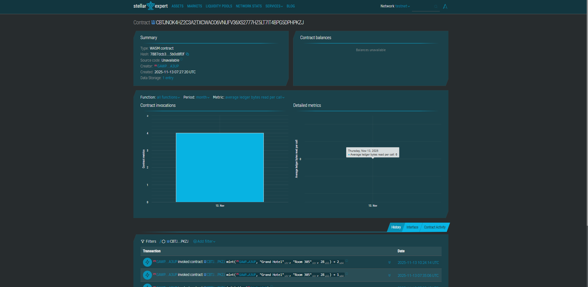

Tokenized Hotel-Timeshare Access

Project Description

This is a simple Soroban smart contract to issue, manage, and transfer tokens representing access rights for hotel stays (timeshares).

Each token is a unique on-chain asset that represents a specific "right to use" (e.g., Week 28 in Room 305 of the Grand Hotel). This contract acts as the central ledger for minting these rights, tracking their ownership, and allowing for peer-to-peer transfers.

Project Vision

To create a transparent, liquid, and secure secondary market for real-world assets like timeshares. By tokenizing these rights on the Stellar network, owners can easily sell, trade, or transfer their "weeks" without complex traditional paperwork. This allows hotels and timeshare operators to track ownership verifiable on-chain, opening up new possibilities for fractional ownership and global accessibility.

Key Features

This simple implementation includes the core functions necessary to prove the concept:

Contract Initialization: An initialize function sets a permanent ADMIN address (the "hotel operator") who is the only one with permission to create new timeshare tokens.

Admin-Only Minting: A secure mint function allows the ADMIN to create new timeshare tokens, specifying the hotel, room, week, and the initial owner.

On-Chain Ownership: The contract maintains an internal registry that maps each unique token_id to its current owner's Address.

Secure Peer-to-Peer Transfer: A transfer function allows the current owner of a token to transfer it to any other address. The contract enforces this by requiring the signature of the "from" address.

Data Transparency: A public, read-only get_info function allows anyone (or any frontend application) to query the contract and verify the details of a specific timeshare token (hotel, room, week) using its token_id.

Future Scope

This foundational contract can be extended with many more features:

Full NFT (SAC) Implementation: Upgrade the contract to fully implement the Stellar Asset Contract (SAC) interface. This would make each timeshare a true NFT, recognizable across the entire Stellar ecosystem and tradable on any Soroban marketplace.

Redemption & Usage: Add a redeem function. This would allow the token owner to "check-in" for their week, which would mark the token as "used" for the current year (e.g., by updating a last_used_year field in the TimeshareInfo struct).

Royalty Fees: Implement a royalty standard so that every time a token is transferred (sold) on a marketplace, a small percentage of the sale automatically goes back to the hotel operator.

Fractionalization: Create a system to allow a single timeshare token (e.g., one week) to be further fractionalized into smaller tokens (e.g., 7 "day" tokens).

Frontend dApp: Build a web-based decentralized application (dApp) using Freighter or other Soroban-compatible wallets to interact with the contract, view a user's "My Timeshares," and initiate transfers.
